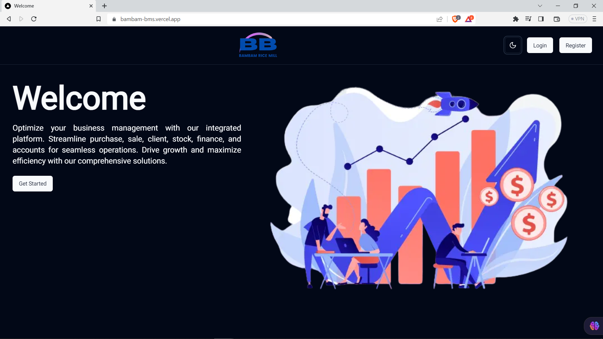
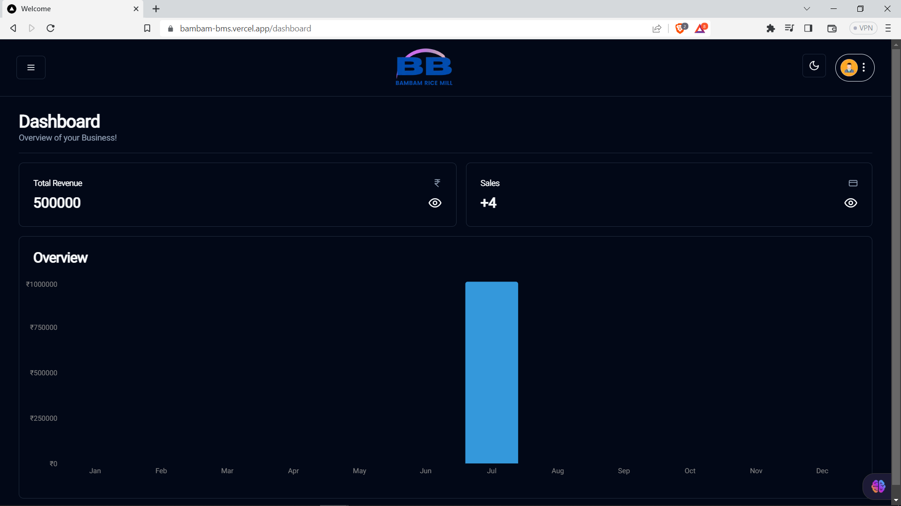

# Full Stack Business Management System with Next.js 13, App Router, React, Shadcn UI, Tailwind, Prisma, NoSQL, MongoDB and NextAuth 2023

#### https://bambam-bms-admin.vercel.app

### Features:

- We will be using Shadcn UI for the Admin!
- Our admin dashboard is going to serve as an Overview of your business
- You will be able to create, update, and delete creditors, debtors, products, purchases, and sales!
- You will be able to see graphs of your revenue, total revenue amount, sales count, etc.
- NoSQL + Prisma + MongoDB





### Prerequisites

**Node version 14.x**

### Cloning the repository

```shell
git clone https://github.com/iprime2/cms-bussiness
```

### Install packages

```shell
npm install
```

### Setup .env file

```js
DATABASE_URL=
NEXTAUTH_SECRET=
NEXTAUTH_URL=
```
 
### Setup Prisma

```shell
npx prisma generate
npx prisma db push

```

### Start the app

```shell
npm run dev
```

## Available commands

Running commands with npm `npm run [command]`

| command         | description                              |
| :-------------- | :--------------------------------------- |
| `dev`           | Starts a development instance of the app |
| `lint`          | Check any javascript error               |
| `build`         | To build the webapp                      |
